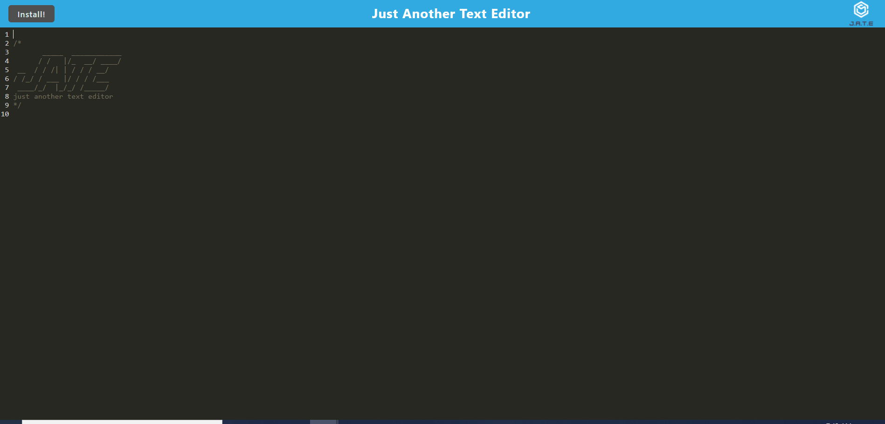

# text-editor

## Description

Site for recording user's notes which meets PWA criteria. Its files are bundled with Webpack, it can be installed from the browser, and it has a service worker.

## Installation

This application requires node.js and MongoDB. Open the root folder of the application in a terminal and enter "npm install". The application can be installed by the user from the browser by clicking "install".

## Usage

To run this application locally, open the root folder in a terminal and enter "npm run start". Go to localhost:3000, preferably using an incognito window. Anything the user writes is saved and will still be seen if the application were closed and opened again.

https://github.com/BrendanShelton/text-editor
https://young-mesa-19765.herokuapp.com/

## Technologies used

Javascript, Node.js, Express, Webpack, IndexedDB 

## Credits

This application is based on starter code provided for an assignment for the University of Richmond coding bootcamp.

## License

MIT License

Copyright (c) 2022 BrendanShelton

Permission is hereby granted, free of charge, to any person obtaining a copy
of this software and associated documentation files (the "Software"), to deal
in the Software without restriction, including without limitation the rights
to use, copy, modify, merge, publish, distribute, sublicense, and/or sell
copies of the Software, and to permit persons to whom the Software is
furnished to do so, subject to the following conditions:

The above copyright notice and this permission notice shall be included in all
copies or substantial portions of the Software.

THE SOFTWARE IS PROVIDED "AS IS", WITHOUT WARRANTY OF ANY KIND, EXPRESS OR
IMPLIED, INCLUDING BUT NOT LIMITED TO THE WARRANTIES OF MERCHANTABILITY,
FITNESS FOR A PARTICULAR PURPOSE AND NONINFRINGEMENT. IN NO EVENT SHALL THE
AUTHORS OR COPYRIGHT HOLDERS BE LIABLE FOR ANY CLAIM, DAMAGES OR OTHER
LIABILITY, WHETHER IN AN ACTION OF CONTRACT, TORT OR OTHERWISE, ARISING FROM,
OUT OF OR IN CONNECTION WITH THE SOFTWARE OR THE USE OR OTHER DEALINGS IN THE
SOFTWARE.